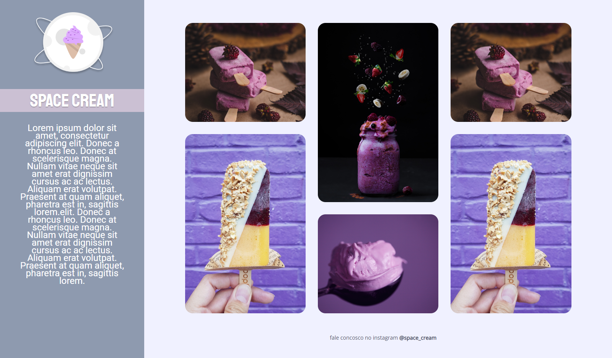
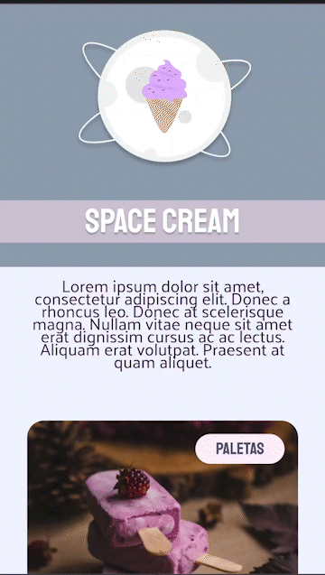

# Desafio - Reponsividade

> Explorer Stage 03 da Rocketseat

## 📝 Descrição
Projeto desenvolvido no curso Explorer da Rocketseat. 

A proposta era recriar o layout de uma sorveteria chama Space Cream utilizando o mobile first e depois adaptando o layout para desktop.
Conteúdo passado em aula que foi utilizado:
- Unidade de medida flexível;
- Variáveis;
- Animações e transições;
- Grid;
- Media queries.

🔗 [Acesse aqui](https://daniyuk.github.io/explorer-space-cream/)

## 💻 Tecnologias 
- HTML
- CSS

## ✨Exemplo da animação no mobile

